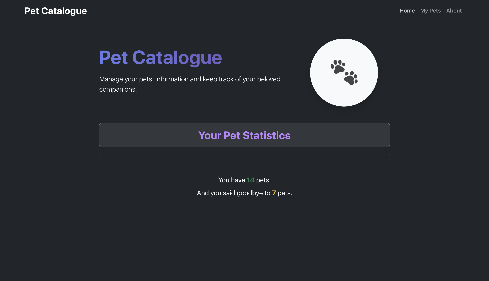
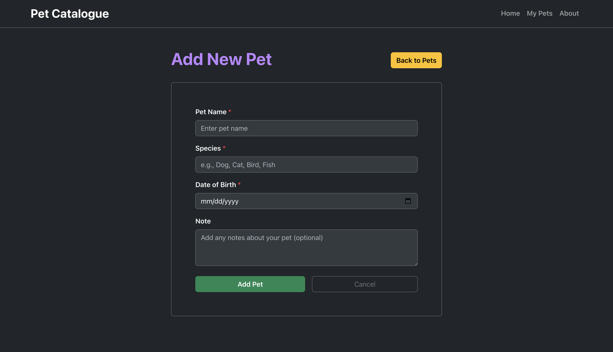
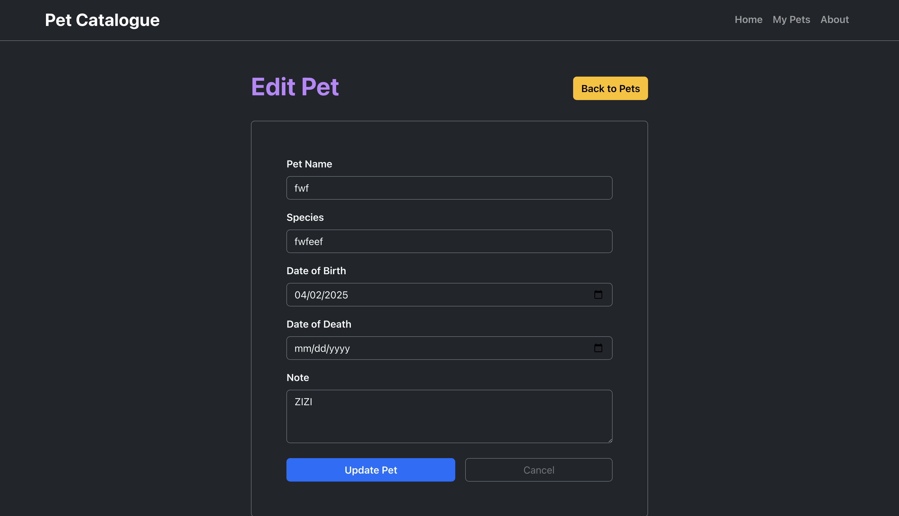
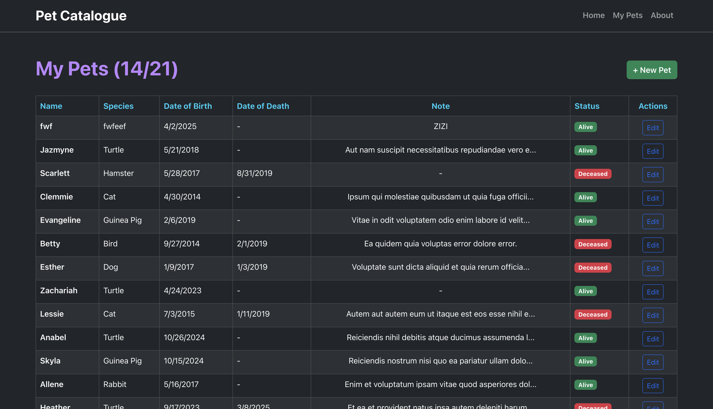

## About

Pet Catalogue is a web application for managing and browsing a collection of pets. Users can view, add, edit, and organize pet profiles, making it easy to keep track of their favorite animals. The project features a modern frontend built with React and a backend powered by Laravel.

## Preview

    
    

    
    

